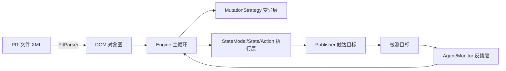
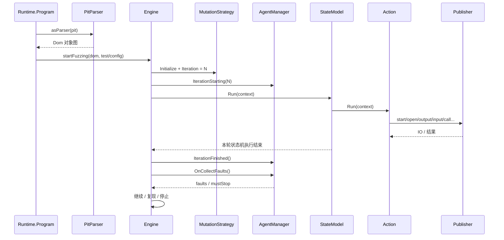
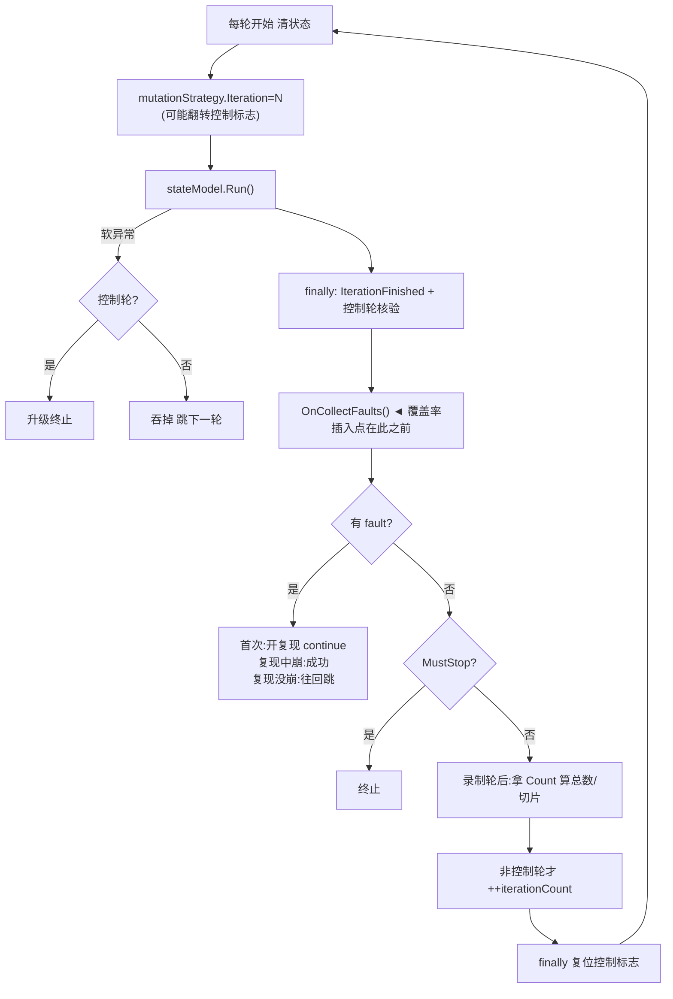

# Peach 工作流手把手教程

> 一份把 **Peach 3.0.202** 从「外到内怎么跑起来」讲透的教程，并逐行拆解调度核心 `Engine.runTest`。
> 适合刚接手 Peach 源码、想做覆盖率引导（coverage-guided）改造的人。

<p align="center">
  <code>Program → PitParser → Dom → Engine → MutationStrategy → StateModel → State → Action → Publisher → AgentManager → 回到 Engine</code>
</p>

---

## 目录

- [0. 两套源码的关系](#0-两套源码的关系)
- [1. 心智模型：Peach 不是「变异工具」](#1-心智模型peach-不是变异工具)
- [2. XML(PIT) 文件有什么用](#2-xmlpit-文件有什么用)
- [3. PIT 如何变成内存对象：DOM 对象图](#3-pit-如何变成内存对象dom-对象图)
- [4. 跟着一轮迭代走一遍调用链](#4-跟着一轮迭代走一遍调用链)
- [5. 三个最容易误解的机制](#5-三个最容易误解的机制)
- [6. 主循环 runTest 逐行精讲](#6-主循环-runtest-逐行精讲)
- [7. 覆盖率引导改造挂在哪](#7-覆盖率引导改造挂在哪)
- [8. 建议的源码阅读顺序](#8-建议的源码阅读顺序)

---

## 0. 两套源码的关系

| 代号 | 路径 | 性质 |
| --- | --- | --- |
| **原版** | `peach-3.0.202-source` | 真正的 Peach 3.0.202 源码 —— 学工作流看这个 |
| **改造版** | `peach-coverage` | 加了覆盖率引导的修改版 —— 看「改了什么」看这个 |

本文行号均对应 **原版** 快照。

---

## 1. 心智模型：Peach 不是「变异工具」

学 Peach 最容易犯的错，是把它想成「一个会随机改文件的 fuzzer」。**变异只是它的一个子系统。**

> Peach 的真身是：**一个以 `Engine` 为中心的、事件驱动的状态机执行框架**。它按「轮次」驱动一个状态机去和目标交互，变异、监控、故障回放都挂在这条主循环上。

从外到内是一条 **8 层流水线**：

| 层 | 核心对象 | 职责 |
| --- | --- | --- |
| ① 命令行入口 | `Peach/Program.cs` | 进程壳，转手就走 |
| ② 运行时总控 | `Runtime/Program.cs` | 解析 CLI → 造出 `RunConfiguration` |
| ③ 配置解析 | `Analyzers/PitParser.cs` | PIT(XML) → DOM 对象图 |
| ④ DOM 对象层 | `Dom/{Dom,Test,StateModel,Action}` | 保存测试结构 |
| ⑤ 调度核心 ★ | `Engine.cs` + `RunContext.cs` | 按轮次驱动整个生命周期 |
| ⑥ 变异层 | `MutationStrategy` + `Mutator` | 决定「这轮变哪、怎么变」 |
| ⑦ 执行层 | `StateModel→State→Action→Publisher` | 真的把动作打到目标上 |
| ⑧ 反馈层 | `AgentManager/Monitor/Watcher/Logger` | 收 fault、决定停不停、输出状态 |



---

## 2. XML(PIT) 文件有什么用

**关键前提：Peach 引擎是「通用」的——它对你的目标一无所知。** 同一个 `Peach.exe`，换一份 PIT，就能去 fuzz 完全不同的目标。

> 类比：Peach 引擎 = 一个通用的 fuzz 机器人；PIT = 你递给它的任务工单。机器人不变，换工单就换目标。

一份 PIT 回答 4 个问题：

| 问题 | PIT 元素 |
| --- | --- |
| ① 变什么数据？（数据长什么样） | `<DataModel>` |
| ② 按什么顺序发？（交互流程） | `<StateModel>` / `<Action>` |
| ③ 怎么送到目标？（IO 方式） | `<Publisher>` |
| ④ 用哪套配置跑？（组装） | `<Test>` |

最小可运行例子 `samples/HelloWorld.xml`：

```xml
<Peach>
  <!-- ① 数据模板：要变异的东西 -->
  <DataModel name="TheDataModel">
    <String value="Hello World!" />
  </DataModel>

  <!-- ② 状态机：动作序列 -->
  <StateModel name="State" initialState="State1">
    <State name="State1">
      <Action type="output">
        <DataModel ref="TheDataModel"/>   <!-- 引用①，发的就是这个 -->
      </Action>
    </State>
  </StateModel>

  <!-- ④ 组装：Engine 真正执行的单位 -->
  <Test name="Default">
    <StateModel ref="State"/>
    <Publisher class="Console" />          <!-- ③ 输出打到控制台 -->
  </Test>
</Peach>
```

真实 fuzz 还会多两块：

```xml
<Data fileName="samples/normal.pdf"/>       <!-- ⑤ 样本种子：变异的起点 -->

<Agent name="Local">                        <!-- ⑥ 监控：怎么发现目标崩了 -->
  <Monitor class="WindowsDebugger">
    <Param name="CommandLine" value="reader.exe fuzzed.pdf"/>
  </Monitor>
</Agent>
```

**总结：PIT = 你对 Peach 下达的「这次要 fuzz 什么、怎么 fuzz、怎么判崩」的完整声明。**

---

## 3. PIT 如何变成内存对象：DOM 对象图

XML 文件在磁盘上只是**一串文本**，文本没法「跑」。而 Engine 要执行的是 `test.stateModel.Run(context)` 这种**对象方法调用**。

**DOM 对象图** = PitParser 读完 XML 后，不保留文本，而是 `new` 出一批 C# 对象并**互相持有引用**，连成的一张网。

顶层 `Dom` 就是一堆命名字典（`Dom.cs:48-53`）：

```csharp
public OrderedDictionary<string, DataModel>  dataModels;
public OrderedDictionary<string, StateModel> stateModels;
public OrderedDictionary<string, Agent>      agents;
public OrderedDictionary<string, Test>       tests;
public OrderedDictionary<string, Data>       datas;
```

**为什么是「图」不是「树」**：加子对象时会回填父引用（`value.parent = this`），加上 `ref="xxx"` 被解析成指向另一个已存在对象的指针（`getRef<T>`, `Dom.cs:122`）——于是出现双向 + 交叉引用，成了有向图。

例如 `Action` 里 `ref="File"` 的 `dataModel`，和顶层 `dataModels["File"]` **指向同一个对象**，不是复制。

> 这也是 §4.1 说「先构造完整对象图再执行、用多 pass 解析」的原因：`Test` 引用 `StateModel/Agent/DataModel` 时，被引用对象必须已经存在。

---

## 4. 跟着一轮迭代走一遍调用链



执行层要点：
- `StateModel.Run` 只在**第一次**把样本文件 crack 进 `Action.dataModel`；之后每轮对「原始模型快照」做 clone，**不再重读文件**。
- `Action` 定义「做什么」，`Publisher` 定义「怎么和目标交互」。换目标只换 publisher。

| Action 类型 | 实际行为 |
| --- | --- |
| `output` | 把 `dataModel.Value.Stream` 喂给 `publisher.output()` ← 文件/网络 fuzz 主战场 |
| `input` | `publisher.input()` 后用 `DataCracker` 把数据 crack 回 `dataModel` |
| `call` | `publisher.call(method, args)` |
| `changeState` | 抛 `ActionChangeStateException`（不直接切换） |

---

## 5. 三个最容易误解的机制

**① 控制轮 / 录制轮**
第一轮永远不 fuzz，它录下「正常执行路径」并让策略统计出总变异数 `Count`。之后每隔 `controlIterationEvery` 插一个控制轮，重跑不变异的基线并比对是否偏离——偏离就报 `PeachControlIteration` fault。

**② 懒触发变异**
Engine 从不主动改内存模型，只做 `mutationStrategy.Iteration = N`。真正的变异发生在对应 `Action.Starting` 事件回调里（`Sequential.cs:287-309`）。所以变异空间**依赖当前 seed 的数据模型结构**。

**③ 故障回放（repro）是一条子状态机**
崩溃在第 N 轮被发现，但真凶可能是 N-1、N-2……于是从 N 往回**跳着重放**（跳步指数放大），试图稳定复现。**repro 轮是「脏」的，不能污染语料/覆盖统计。**

---

## 6. 主循环 runTest 逐行精讲

`Engine.runTest`（`Engine.cs:262-690`）切成 12 块。

### 块 A｜初始化（262-286）
- `new AgentManager(context)` 构造时即订阅 `CollectFaults` 事件（后面收 fault 的前提）。
- `iterationTotal` 是 `uint?`——录制轮跑完前**总数未知**。
- `284-285`：**非确定性策略 + parallel 直接抛异常**（`RandomStrategy` 非确定，parallel 靠区间切片）。

### 块 B｜区间计算 + 强制首轮录制 + 启动 agent（287-331）
- `--range`/`--skipto` 落地成 `iterationStart/Stop`。
- `313-314`：**第一轮永远是 `controlIteration + controlRecordingIteration`**。

### 块 C｜while 条件（333-335）
```csharp
while ((firstRun || iterationCount <= iterationStop) && context.continueFuzzing)
```
`firstRun` 是「第一圈免检票」——录制轮必须无条件先跑一次。

### 块 D｜本轮准备（337-369）
```csharp
mutationStrategy.Iteration = iterationCount;   // ★先设轮号！策略可能借此翻转控制标志
```
`RandomStrategy` 到 dataset 切换点会在这个 setter 内部把当前轮翻成录制轮。所以顺序必须「先设轮号，再判断控制标志」。

### 块 E｜执行状态机 + 吞软异常（371-420）
```csharp
test.stateModel.Run(context);   // ★★★ 真正干活
```
`SoftException`/`PathException` 在**普通轮被故意吞掉**（非法变异，跳下一轮）；同样异常在**控制轮**则升级为 `PeachException` 终止（连原样输入都跑不通=环境坏了）。

### 块 F｜finally：核验控制轮（421-485）
无论成功失败都调 `IterationFinished()`。若「是控制轮 && 非录制轮 && action 确定」，拿本轮执行的 action/state 跟基线比数量、比集合，偏离就 `OnControlFault`。

### 块 G｜可选等待（487-498）
`waitTime` / `faultWaitTime` 给目标时间把崩溃暴露出来。

### 块 H｜收集 fault（500-501）
```csharp
context.OnCollectFaults();   // 触发事件 → AgentManager 收 fault
```
> 📌 覆盖率是「每轮都要、但不代表 fault」的数据，它搭不了 fault 的顺风车（`DetectedFault==true` 才走）。改造版必须在**这一行之前**另开一条 feedback 通道。

### 块 I｜有 fault：报告 + 复现决策（503-566）★最难
1. 给每个 fault 盖章（第几轮/是否控制轮/是否录制轮）。
2. 已在复现中 or 关了 replay → `OnFault`（正式）；否则 `OnReproFault`（疑似）。
3. **控制轮崩溃 = 死刑**，直接终止。
4. 复现中又崩 = 复现成功，关复现。
5. 首次发现 → 开复现，`continue` 重放当前轮。

### 块 J｜复现中没崩：往回倒着找（567-591）
从 N 往回跳着重放，跳步 `*= reproducingSkipMultiple`；超 `reproducingMaxBacksearch` 就 `OnReproFailed` 放弃。

### 块 K｜MustStop + 首个录制轮后算总数/切片（593-630）
```csharp
if (controlIteration && controlRecordingIteration && !iterationTotal.HasValue) {
    iterationTotal = mutationStrategy.Count;   // ★到这里才知道总轮数
    ... parallel 用 SliceRange 切片 ...
}
```
**Peach 不从 PIT 静态推算总轮数，而是靠录制轮动态统计。**

### 块 L｜自增（632-637）
```csharp
if (!context.controlIteration) ++iterationCount;   // ★控制轮不消耗轮号！
```

### 块 M｜RedoIteration 重试 + finally 复位控制标志（639-661）
`RedoIterationException` 最多重试 3 次。每轮末尾把控制/录制标志复位为 false（**复现期间跳过复位**）。

### 块 N｜外层收尾（664-690）
`MutatorCompleted` = 确定性策略跑完的正常信号。最外层 `finally` 停 publisher → `SessionFinished` → 停监控 → 收尾。**agent/publisher 生命周期被整个 run 包住。**

### 整轮状态流



---

## 7. 覆盖率引导改造挂在哪

改造方案的核心论点：**Peach 现有的 fault 通道扛不了「每轮覆盖率」**（`GetMonitorData()` 只在 `DetectedFault()==true` 时才走）。所以在主循环里**并联一条独立的 per-iteration feedback 通道**。

| 改造项 | 挂点 | 原版 → 改造版 |
| --- | --- | --- |
| 存覆盖率反馈状态 | RunContext 共享中枢 | `RunContext.cs`（加字段） |
| 每轮采集覆盖率 | 块 H 之前 | `Engine.cs` |
| 从监控读覆盖率 | agent 生命周期 | 新增 `Agent/Monitors/CoverageMonitor.cs` |
| seed 调度替代随机 | 块 D 的策略层 | 新增 `MutationStrategies/CoverageGuidedStrategy.cs` |
| 语料/覆盖图数据结构 | 反馈层新增 | `Analysis/Coverage.cs` |

第一版建议边界：单进程 + 文件输入 + 单主输出 action + 本地 agent + **禁用 parallel**。

---

## 8. 建议的源码阅读顺序

1. `Peach/Program.cs`
2. `Peach.Core/Runtime/Program.cs`
3. `Peach.Core/RunConfig.cs`
4. `Peach.Core/Analyzers/PitParser.cs`
5. `Peach.Core/Dom/Dom.cs`
6. `Peach.Core/Dom/Test.cs`
7. **`Peach.Core/Engine.cs`** ★
8. `Peach.Core/RunContext.cs`
9. `Peach.Core/Dom/StateModel.cs`
10. `Peach.Core/Dom/State.cs`
11. `Peach.Core/Dom/Action.cs`
12. `Peach.Core/Publisher.cs`
13. `Peach.Core/MutationStrategy.cs`
14. `Peach.Core/MutationStrategies/Sequential.cs`
15. `Peach.Core/MutationStrategies/RandomStrategy.cs`
16. `Peach.Core/Agent/AgentManager.cs`

时间有限的话，前 8 个优先级最高。

---

## 三个必须记牢的反直觉点

1. **第一轮不 fuzz**（录制基线 + 统计总数）；
2. **控制轮不消耗轮号**，且会拿本轮执行路径跟基线比对；
3. **变异是懒触发的**——Engine 只设轮号，实际变异在 `Action.Starting` 回调里发生。
